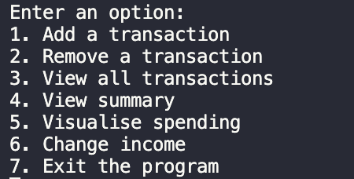
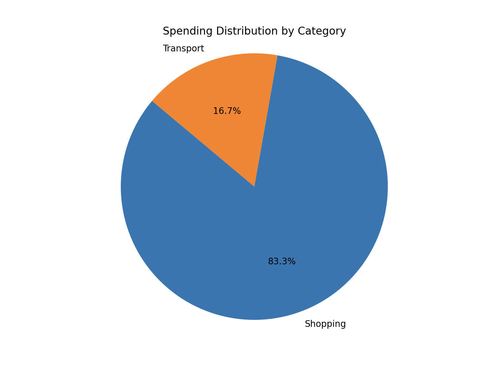
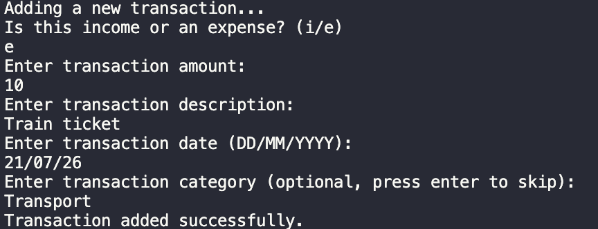
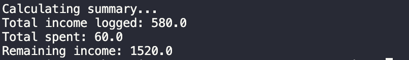

# Finance Tracker

A  Python CLI project that helps users track income and expenses, analyse their spending habits and generate financial reports

## About the Project

I built this project to improve my Python programming skills while creating a practical tool for managing personal finances.

The application allows users to record transactions, categorise spending, view summaries, visualise expenses and export financial data.

## Features
- Add/remove income and expense transactions
- View all transactions
- Categorise expenses (Food, Transport, etc.)
- Simple menu system
- Saves data to JSON file
- Graphical visualisation using matplotlib
- Export to CSV file (Spending report)

## Demo









## Technologies used
- Python
- JSON (data storage)
- CSV (report exporting)
- Matplotlib (data visualisation)
- Git & GitHub

## Installation

Clone the repository:

```bash
git clone https://github.com/enov999/finance-tracker.git
```

Navigate into the project folder:

```bash
cd finance-tracker
```

Install the required dependency:

```bash
pip install matplotlib
```

Run the application:

```bash
python main.py
```

The application will start in the terminal and display the main menu.

## Future improvements

- Add monthly spending breakdowns
- Add a graphical user interface (GUI)
- Move from JSON storage to a database (SQLite)
- Add user authentication

## Challenges

One challenge was designing how transactions should be stored and retrieved. I chose JSON because it allowed data to be persistently saved between sessions while keeping the structure simple. I also implemented validation to prevent invalid user
inputs from crashing the program.


